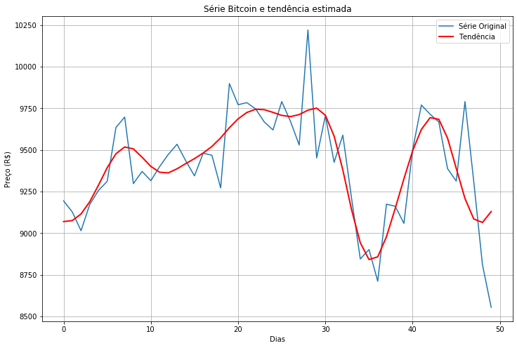

# tendenciaserietemporalutiliozandodwt
<h2>Obtenção de Tendências em Séries Temporais utilizando Transformada Wavelet</h2>

Exemplo de uma série temporal e da curva de tendência estimada 
 

Consulta o arquivo TendenciaST.ipynb para detalhes

